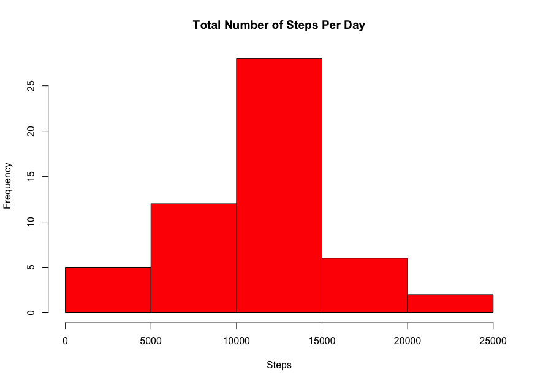
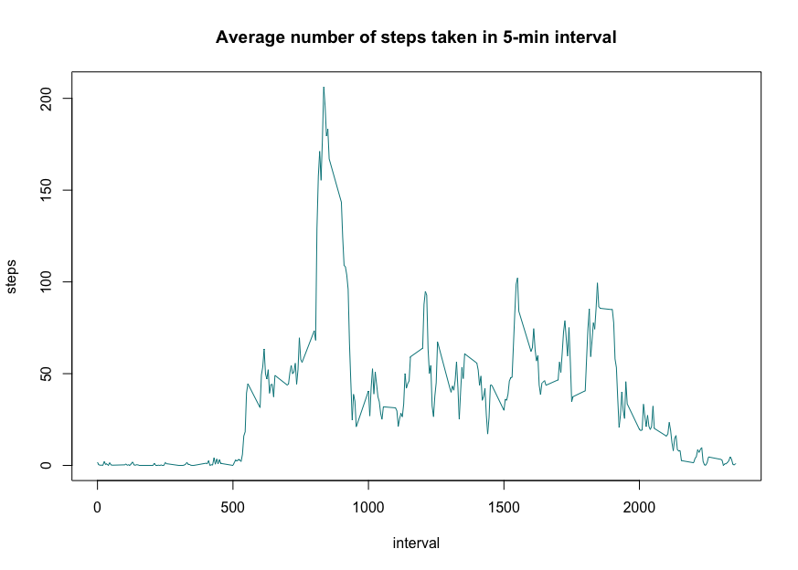
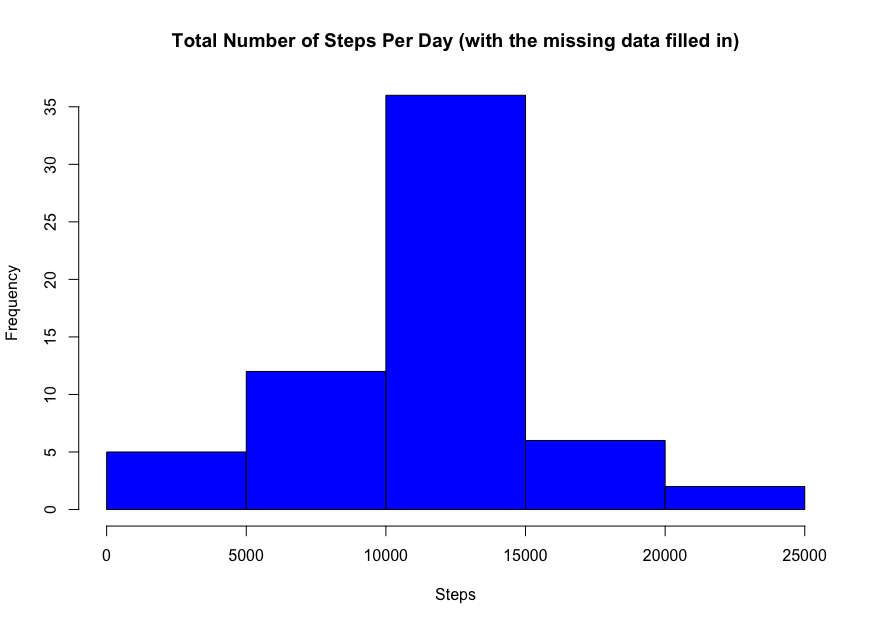
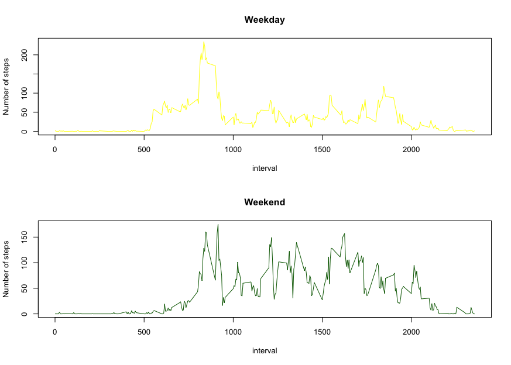

```r
library(markdown)
library(knitr)
opts_chunk$set(tidy = TRUE)
```

# Loading and preprocessing the data

### 1. We load and read the CSV file.    
 
```r 
activity <- read.csv("activity.csv", header = TRUE)
```

# What is mean total number of steps taken per day?

### 1. We subset the original data to calculate the total number of steps
 
```r
totalStepsByDay <- aggregate(steps~date, data, sum)
head(totalStepsByDay)
```
```
   date         steps
1  2012-10-02     126
2  2012-10-03   11352
3  2012-10-04   12116
4  2012-10-05   13294
5  2012-10-06   15420
6  2012-10-07   11015

```

### 2. We make a histogram of the total number of steps taken each day
```r
hist(totalStepsByDay$steps, col = "red"
     , xlab = "Steps", main = "Total Number of Steps Per Day")
```

 

### 3. We determine and report the mean and median total number of steps taken per day

####     a. mean

```r
mean1 <- mean(totalStepsByDay$steps)
mean1
```
```
10766.19
```
####    b. median
```r
median1 <- median(totalStepsByDay$steps)
median1
```
```
10765
```
# What is the average daily activity pattern?

### 1. Subset the original data to calculate the average number of steps taken of the 5-minute interval

```r
averageSteps <- aggregate(steps~interval, data, mean)
head(averageSteps)
```
```
        interval     steps
1        0           1.7169811
2        5           0.3396226
3       10           0.1320755
4       15           0.1509434
5       20           0.0754717
6       25           2.0943396
```

### 2. We make a time series plot

```r
with(averageSteps, plot(interval, steps
                        , type="l", main="Average number of steps taken in 5-min interval"
                        , col = "turquoise4")) 
```              

 

### maximum number of steps

```r
max <- max(averageSteps$steps)
max
```
```
206.1698
```

### The interval contains max data is:
```r
subsetData <- subset(averageSteps, steps == max)
subsetData
subsetData$interval
``` 
```
835
```

# Imputing missing values

### 1. We calculate and report the total number of missing values
```r
colSums(is.na(data))
```
```
steps     date interval 
    2304        0        0 
```

### 2. We create a new column "newSteps"

```r
data$newSteps <- averageSteps$steps
head(data)
```
```
  steps       date        interval  newSteps
1    NA   2012-10-01        0       1.7169811
2    NA   012-10-01         5       0.3396226
3    NA   2012-10-01       10       0.1320755
4    NA   2012-10-01       15       0.1509434
5    NA   2012-10-01       20       0.0754717
6    NA   2012-10-01       25       2.0943396
```

### 3. We fill in the missing data
```r
data$steps[is.na(data$steps)] <- data$newSteps
```
```
Warning:
In data$steps[is.na(data$steps)] <- data$newSteps :
  Number of elements to be replaced is not a multiple of the replacement length
```

### 4. We create a new dataset
```r
data$newSteps <- NULL
newdata <- data
head(newdata)
```
```
      steps       date          interval
1 1.7169811       2012-10-01        0
2 0.3396226       2012-10-01        5
3 0.1320755       2012-10-01       10
4 0.1509434       2012-10-01       15
5 0.0754717       2012-10-01       20
6 2.0943396       2012-10-01       25
```

### 5. We subset in the new data set to calculate the total number of steps per day
```r
sumdata <- aggregate(steps~date, newdata, sum)
head(sumdata)
```
```
        date    steps
1 2012-10-01    10766.19
2 2012-10-02      126.00
3 2012-10-03    11352.00
4 2012-10-04    12116.00
5 2012-10-05    3294.00
6 2012-10-06    15420.00
```
### 6. we make a histogram
```r
hist(sumdata$steps, col = "blue"
     , xlab = "Steps"
     , main = "Total Number of Steps Per Day (with the missing data filled in)")
```     

 

### 7. We calculate and report the mean and median

####     a. mean
```r
mean2 <- mean(sumdata$steps)
mean2
```
```
10766.19
```
####     b. median
```r
median2 <- median(sumdata$steps)
median2
```
```
10766.19
```
### 8. Calculate the differences 

```r
mean2 - mean1
```
```
0
```
```r
median2 - median1
```
```
1.188679
```
# Are there differences in activity patterns between weekdays and weekends?

### load the timeDate package
```r
install.packages("timeDate")
library(timeDate)
```

### 1. Create a new column, and use the isWeekday() function to check if the date is weekday or weekend

```r
newdata$Weekday <- isWeekday(newdata$date)
head(newdata)
```
```
steps       date interval Weekday
1 1.7169811 2012-10-01        0    TRUE
2 0.3396226 2012-10-01        5    TRUE
3 0.1320755 2012-10-01       10    TRUE
4 0.1509434 2012-10-01       15    TRUE
5 0.0754717 2012-10-01       20    TRUE
6 2.0943396 2012-10-01       25    TRUE
```

### 2. We subset and calculate the average steps for weekday and weekend

```r
weekday <- subset(newdata, newdata$Weekday == "TRUE")
weekdayMean <- aggregate(steps ~ interval, data = weekday, mean)
head(weekdayMean)
```
```
 interval      steps
1        0 2.25115304
2        5 0.44528302
3       10 0.17316562
4       15 0.19790356
5       20 0.09895178
6       25 1.59035639
```
```r
weekend <- subset(newdata, newdata$Weekday == "FALSE")
weekendMean <- aggregate(steps ~ interval, data = weekend, mean)
head(weekendMean)
```
```
interval       steps
1        0 0.214622642
2        5 0.042452830
3       10 0.016509434
4       15 0.018867925
5       20 0.009433962
6       25 3.511792453
```
### 3. We Make the panel plot to calculate the average number of steps taken for weekday 

```r
layout(matrix(c(1,1,2,2), 2, 2, byrow = TRUE))
```

```r
plot(weekdayMean$interval, weekdayMean$steps
     , xlab = "interval", ylab = "Number of steps"
     , main ="Weekday", col ="yellow", type="l") 
```
### 4. We Make the panel plot to calculate the average number of steps taken for  weekend

```r
plot(weekendMean$interval, weekendMean$steps
     , xlab = "interval", ylab = "Number of steps"
     , main ="Weekend", col ="darkgreen", type="l")
```

 
